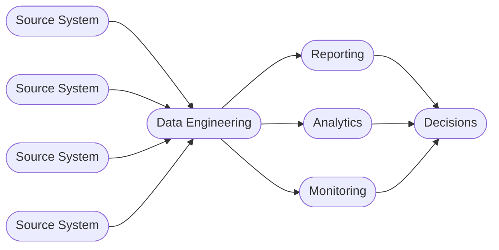

# Business intelligence

## Table of contents

<!-- markdown-toc:start -->
- [Definition](#definition)
- [Applications](#applications)
<!-- markdown-toc:end -->

## Definition

Business intelligence (BI) is the process of collecting, analyzing, and presenting business data to help organizations make informed, data-driven decisions. The definition of business intelligence overlaps with data engineering, but a key distinction is that BI includes presenting data to end users, while data engineering focuses on data processing and integration rather than presentation.

## Applications

| Application | Description |
| --- | --- |
| Reporting | Recurring delivery of predefined metrics in a fixed layout. |
| Analytics | Exploring and analyzing data to discover patterns and forecast outcomes. |
| Monitoring | Continuous tracking of metrics with alerts when values deviate from expected patterns. |

## Project structure

<!-- markdown-project-structure:start -->
- [Data Engineering Design Patterns](../readme.md)
  - Definitions
    - [Business intelligence](business-intelligence.md)
    - [Data engineering](data-engineering.md)
  - Design patterns
    - Data engineering
      - [Data extractor](../design-patterns/data-engineering/data-extractor.md)
      - [Data object container](../design-patterns/data-engineering/data-object-container.md)
      - [Data object poller](../design-patterns/data-engineering/data-object-poller.md)
      - [Data object](../design-patterns/data-engineering/data-object.md)
      - [Data solution layer](../design-patterns/data-engineering/data-solution-layer.md)
      - [Data solution](../design-patterns/data-engineering/data-solution.md)
      - [Event-based orchestration](../design-patterns/data-engineering/event-based-orchestration.md)
      - [Historic bitemporal table](../design-patterns/data-engineering/historic-bitemporal-table.md)
      - [Data object property tree](../design-patterns/data-engineering/object-property-tree.md)
    - Generic
      - [Functional decomposition](../design-patterns/generic/functional-decomposition.md)
      - [Prefer simple decomposition](../design-patterns/generic/prefer-simple-decomposition.md)
      - [Separate what and how](../design-patterns/generic/separate-what-and-how.md)
      - [Simplicity](../design-patterns/generic/simplicity.md)
  - Implementation
    - Event Based Orchestration
      - [Event-based orchestration architecture](../implementation/event-based-orchestration/architecture.md)
      - [Azure event-based orchestration architecture](../implementation/event-based-orchestration/azure-architecture.md)
      - [Tool choice for a data warehouse orchestration tool](../implementation/event-based-orchestration/tool-choice.md)
- Related repositories
  - [Data Engineering 2026](https://github.com/basvdberg/data-engineering-2026)
  - [Data Solution 2026](https://github.com/basvdberg/data-solution-2026)
<!-- markdown-project-structure:end -->
