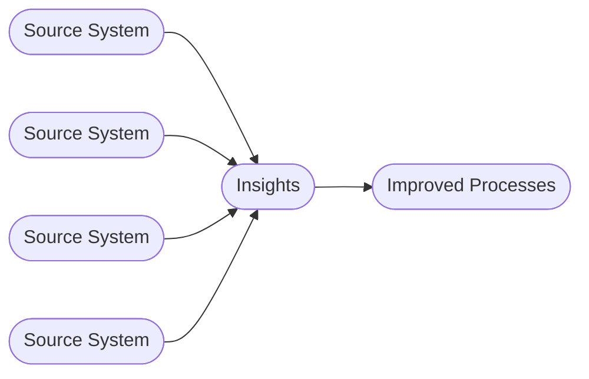

# Business intelligence

Business intelligence (BI) is the process of collecting, analyzing, and presenting business data to help organizations make informed, data-driven decisions. The definition of business intelligence overlaps with data engineering, but a key distinction is that BI includes presenting data to end users, while data engineering focuses on data processing and integration rather than presentation.

## Project table of contents

<!-- project-toc:start -->
- [Data Engineering Design Patterns](../readme.md)
  - Definitions
    - [Business intelligence](business-intelligence.md)
    - [Data engineering](data-engineering.md)
  - Design patterns
    - [Data solution](../design-patterns/data-solution.md)
    - [Event-based orchestration](../design-patterns/event-based-orchestration.md)
    - [Historic bitemporal table](../design-patterns/historic-bitemporal-table.md)
    - [Object property tree](../design-patterns/object-property-tree.md)
<!-- project-toc:end -->
