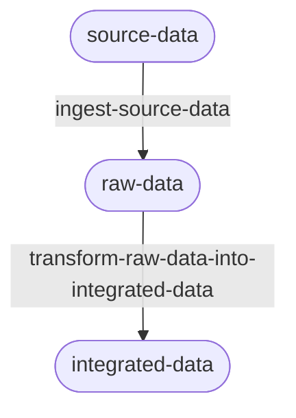

# Data engineering

## Table of contents

<!-- markdown-toc:start -->
- [Components](#components)
  - [Ingest source data](#ingest-source-data)
    - [Definition](#definition)
    - [Rationale](#rationale)
    - [Examples](#examples)
  - [Transform raw data into integrated data](#transform-raw-data-into-integrated-data)
    - [Definition](#definition)
    - [Rationale](#rationale)
    - [Examples](#examples)
- [Implementation](#implementation)
  - [Ingest source data](#ingest-source-data)
<!-- markdown-toc:end -->

## Components

### Ingest source data

#### Definition
  - Use the interface provided by each source, including its query language, output format and data structure.
  - Follow the delivery contract, which specifies when data can be extracted and how often extraction is allowed.

#### Rationale
- **Connecting correctly to each source:** Use the right protocol, query language, schema, and format so data is extracted accurately and consistently.
- **Protecting source systems:** Control extraction load, schedule outside peak hours, and avoid conflicts with backups or maintenance.
- **Respecting data contracts:** Define what data can be extracted, when it can be delivered, and how often it is refreshed.
- **Security/privacy:** Ensure a data owner explicitly grants permission to use its data for specific applications and approved purposes only.
- **Traceability:** Document data origin, extraction logic, and operating rules to support auditing and lineage in further stages. 

#### Examples

| Source type | Example format |
| --- | --- |
| SQL Server database | Accessed over TCP/IP and queried with SQL to retrieve required data (interface). Access may be limited to specific tables and allowed only outside working hours, while avoiding overlap with backup and maintenance windows (contract). |
| Legacy mainframe system | Delivers a CSV file in a shared folder at a fixed time (for example around 23:00). The file contains only approved data fields and becomes available immediately after generation. |
| Operational Data Store (Delta table) | Provides a Delta table that is refreshed by the Operational Data Store on a defined schedule. Data is read using the Delta format. When a new snapshot is made available, all downstream subscribers are notified via an event. |

### Transform raw data into integrated data

#### Definition
  - Standardize and clean raw source data to create consistent, reusable datasets.
  - Apply business rules, joins, mappings, and validations to integrate data across source systems.
  - Publish the transformed output in a structured layer that downstream consumers can use.

#### Rationale
- **Data consistency:** Ensure common definitions, formats, and keys are used across all datasets.
- **Data quality:** Detect and correct errors, duplicates, and missing values before data is consumed.
- **Business context:** Convert technical source fields into business-ready attributes and metrics.
- **Integration across domains:** Combine records from multiple systems into a unified view.
- **Reusability:** Create curated datasets that can be used by analytics, reporting, and AI use cases.
- **Traceability:** Preserve lineage between raw inputs, transformation logic, and integrated outputs.

#### Examples

| Transformation type | Example format |
| --- | --- |
| Standardization | Convert date formats, country codes, and column names to enterprise standards. |
| Business rule mapping | Map source status codes to a shared business status model used across applications. |
| Multi-source integration | Join CRM customer records with billing and support data to produce a unified customer table. |

## Implementation

### Ingest source data

Implementation follows these concepts:
- Contract-first ingestion between data owner and consumer.
- Controlled connectivity and extraction within agreed delivery constraints.
- Idempotent orchestration with retries, error handling, and operational traceability.
- Event-driven control loop (events, rules, templates, queueing, execution).

## Project structure

<!-- markdown-project-structure:start -->
- [Data Engineering Design Patterns](../readme.md)
  - Definitions
    - [Business intelligence](business-intelligence.md)
    - [Data engineering](data-engineering.md)
  - Design patterns
    - [Data extractor](../design-patterns/data-extractor.md)
    - [Data object container](../design-patterns/data-object-container.md)
    - [Data object poller](../design-patterns/data-object-poller.md)
    - [Data object](../design-patterns/data-object.md)
    - [Data solution layer](../design-patterns/data-solution-layer.md)
    - [Data solution](../design-patterns/data-solution.md)
    - [Event-based orchestration](../design-patterns/event-based-orchestration.md)
    - [Historic bitemporal table](../design-patterns/historic-bitemporal-table.md)
    - [Data object property tree](../design-patterns/object-property-tree.md)
    - [Separate what and how](../design-patterns/separate-what-and-how.md)
  - Implementation
    - Event Based Orchestration
      - [Event-based orchestration architecture](../implementation/event-based-orchestration/architecture.md)
      - [Azure event-based orchestration architecture](../implementation/event-based-orchestration/azure-architecture.md)
      - [Tool choice for a data warehouse orchestration tool](../implementation/event-based-orchestration/tool-choice.md)
- Related repositories
  - [Data Engineering 2026](https://github.com/basvdberg/data-engineering-2026)
  - [Data Solution 2026](https://github.com/basvdberg/data-solution-2026)
<!-- markdown-project-structure:end -->
