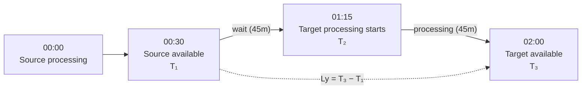

# Data object quality of service

## Table of contents

<!-- markdown-toc:start -->
- [Purpose](#purpose)
- [Dimensions](#dimensions)
  - [Data freshness](#data-freshness)
    - [Frequency](#frequency)
    - [Latency](#latency)
  - [Data availability](#data-availability)
    - [Availability](#availability)
    - [General availability](#general-availability)
    - [End of support](#end-of-support)
    - [End of life](#end-of-life)
    - [Retention](#retention)
  - [Data service levels](#data-service-levels)
    - [Throughput](#throughput)
    - [Error rate](#error-rate)
    - [Time to detect](#time-to-detect)
    - [Time to notify](#time-to-notify)
    - [Time to repair](#time-to-repair)
- [References](#references)
<!-- markdown-toc:end -->

## Purpose

Quality of Service defines the **quality metrics** for data delivery to consumers. The definition is borrowed from networking and is expressed through three dimension categories:

- **Data freshness** — How often data is updated and how soon it is available after creation at the source.
- **Data availability** — Whether consumers can reach the data object, when it is supported and retired, and how long records are kept.
- **Data service levels** — Delivery capacity, reliability, and incident response times from detection through repair.

The [data object contract](data-object-contract.md) combines quality-of-service metrics with a [data object refresh contract](data-object-refresh-contract.md) for the same published object.

## Dimensions

### Data freshness

#### Frequency

Frequency (Fy) defines how often the producer updates the data object, such as every 15 minutes, daily, or monthly. It sets a regularity expectation that consumers use for planning and dependency timing.

#### Latency

Latency (Ly) measures elapsed time between data creation at the source and availability to consumers. It is a key freshness indicator for time-sensitive analytics and operations.

Latency is defined as the duration of processing the data plus the elapsed time between the data becoming available and the process job being started. Latency is defined with respect to the direct sources of a data object, but because there is often a chain of data objects that need to be refreshed, it makes sense to calculate latency for the entire delivery chain. This tells you the total time between the first source becoming available and the current data object becoming available.

### Data availability

#### Availability

Availability (Av) measures whether consumers can reach the data object when they need it. It is typically expressed as a percentage over a period and is evaluated at the access boundary where consumers connect.

#### General availability

General availability (Ga) marks when a data object or version is ready for broad consumer use. It defines the point from which the producer commits to stable, supported consumption behavior.

#### End of support

End of support (Es) is the date after which the producer no longer commits to fixes or operational assistance for that version of the data object. Consumers can still use the object for some time, but they should plan migration.

#### End of life

End of life (El) is the date after which the data object is no longer available for access. At this point, connection attempts fail or files are removed according to retirement policy.

#### Retention

Retention (Re) defines how long records are preserved before archival or deletion. It aligns legal, regulatory, and business needs with predictable data lifecycle behavior.

### Data service levels

#### Throughput

Throughput (Th) measures how much data can be delivered per unit of time. It describes sustained transfer capacity and helps set expectations for large extracts, batch windows, and concurrent reads.

#### Error rate

Error rate (Er) measures how often delivery or access requests fail during a defined period. It captures reliability from the consumer perspective and is tracked as a ratio of failed operations to total operations.

#### Time to detect

Time to detect (Td) measures how long it takes to discover an incident after it begins. Lower detection time reduces exposure to bad or unavailable data and shortens downstream impact.

#### Time to notify

Time to notify (Tn) measures how long it takes to inform affected consumers after an issue is detected. It sets expectations for communication responsiveness and coordinated incident handling.

#### Time to repair

Time to repair (Tr) measures how long it takes to restore agreed service after detection. It reflects operational recovery capability and closes the incident lifecycle.

## References

- Nichols, K., Blake, S., Baker, F., & Black, D. (1998). *RFC 2475: An Architecture for Differentiated Services*. Internet Engineering Task Force. https://www.rfc-editor.org/rfc/rfc2475 — Adapted delivery-quality dimensions (throughput, latency, availability, reliability) for data objects.

- Bitol. (2024). *Open Data Contract Standard v3.1.0: Service level agreement*. Linux Foundation. https://bitol-io.github.io/open-data-contract-standard/v3.1.0/service-level-agreement/ — `slaProperties` vocabulary for `Frequency`, `Latency`, `timeOfAvailability`, `Retention`, and time-to-repair dimensions.

## Project structure

<!-- markdown-project-structure:start -->
- [Data Engineering Design Patterns](../../readme.md)
  - Definitions
    - [Business intelligence](../../definitions/business-intelligence.md)
    - [Data engineering](../../definitions/data-engineering.md)
    - [Data](../../definitions/data.md)
  - Design patterns
    - Data engineering
      - [Data extractor](data-extractor.md)
      - [Data object container](data-object-container.md)
      - [Data object contract](data-object-contract.md)
      - [Data object poller](data-object-poller.md)
      - [Data object quality of service](data-object-quality-of-service.md)
      - [Data object quality](data-object-quality.md)
      - [Data object refresh contract](data-object-refresh-contract.md)
      - [Data object tree property inheritance](data-object-tree-property-inheritance.md)
      - [Data object tree](data-object-tree.md)
      - [Data object](data-object.md)
      - [Data solution layer](data-solution-layer.md)
      - [Data solution](data-solution.md)
      - [Event-based orchestration](event-based-orchestration.md)
      - [Historic bitemporal table](historic-bitemporal-table.md)
    - Generic
      - [Functional decomposition](../generic/functional-decomposition.md)
      - [Prefer simple decomposition](../generic/prefer-simple-decomposition.md)
      - [Separate what and how](../generic/separate-what-and-how.md)
      - [Simplicity](../generic/simplicity.md)
  - Implementation
    - Data Object Refresh Contract
      - [Data object refresh contract alternatives](../../implementation/data-object-refresh-contract/alternatives.md)
    - Event Based Orchestration
      - [Event-based orchestration architecture](../../implementation/event-based-orchestration/architecture.md)
      - [Azure event-based orchestration architecture](../../implementation/event-based-orchestration/azure-architecture.md)
      - [Tool choice for a data warehouse orchestration tool](../../implementation/event-based-orchestration/tool-choice.md)
- Related repositories
  - [Data Engineering 2026](https://github.com/basvdberg/data-engineering-2026) — Course and learning materials
  - [Data Solution 2026](https://github.com/basvdberg/data-solution-2026) — Data solution proof of concept
<!-- markdown-project-structure:end -->
