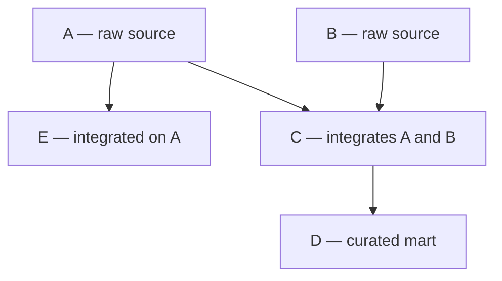

# Data object refresh contract

## Table of contents

<!-- markdown-toc:start -->
- [Purpose](#purpose)
- [Components](#components)
  - [RefreshTrigger](#refreshtrigger)
  - [PermittedExtractWindow](#permittedextractwindow)
  - [AccessMode](#accessmode)
  - [RefreshScope](#refreshscope)
  - [SnapshotTime](#snapshottime)
  - [ArrivalWindow](#arrivalwindow)
  - [BackfillWindow](#backfillwindow)
- [Use cases](#use-cases)
  - [1. Time-triggered full refresh (A)](#1-time-triggered-full-refresh-a)
  - [2. Single dependency-triggered full refresh](#2-single-dependency-triggered-full-refresh)
  - [3. Multiple dependency-triggered full refresh](#3-multiple-dependency-triggered-full-refresh)
  - [4. Multiple dependency-triggered full refresh out-of-sync](#4-multiple-dependency-triggered-full-refresh-out-of-sync)
  - [5. Multiple dependency-triggered refresh with incomplete upstream](#5-multiple-dependency-triggered-refresh-with-incomplete-upstream)
  - [6. Partition-aligned refresh](#6-partition-aligned-refresh)
  - [7. Late arrival and backfill](#7-late-arrival-and-backfill)
- [References](#references)
<!-- markdown-toc:end -->

## Purpose

The `DataObjectRefreshContract` defines how a data object is refreshed. It forms the refresh-contract half of the [data object contract](data-object-contract.md); consumer-facing quality metrics are defined in [data object quality of service](data-object-quality-of-service.md).

## Components

### RefreshTrigger

`RefreshTrigger` defines when refresh starts: time-based, dependency-based, or both.

`condition` must be a logical expression (for example boolean operators and predicate/function calls) and must not use natural-language sentences.

In `dependsOn`, suffix a dependency with `?` when it is preferred but not mandatory (for example `A?`).

### PermittedExtractWindow

`PermittedExtractWindow` is the agreed window when the source may be read: clock bounds (`start`, `end`) and which calendar days apply (`byDay`). Downstream objects often omit this field.

`byDay` follows [RFC 5545](https://datatracker.ietf.org/doc/html/rfc5545) (iCalendar) `BYDAY` day codes (`MO`–`SU`). Use a preset — `weekdays` (Mon–Fri), `weekend` (Sat–Sun), `workingDays` (weekdays minus public holidays; optional `businessCalendar` names the holiday set) — or a list of day codes. Omit `byDay` when every day applies.

### AccessMode

`AccessMode` is how consumers reach source data: `direct` (live source) or `snapshot` (published copy).

**Direct access** — consumers read the live data set during the `PermittedExtractWindow`.

**Snapshot** — the source publishes a fixed copy through a declared **snapshot interface**: delivery location, format, schema version, publish signal, and change notices. The owning team maintains the interface when the source changes and communicates updates to consumers. Operations uses the interface to align `PermittedExtractWindow` with maintenance. The data owner decides which fields and rows are published, including permission and privacy rules.

| | Direct access | Snapshot |
|---|---------------|----------|
| **Pros** | Consumers read current source state without waiting for a publish step. No dependency on a separate snapshot pipeline or owner release cycle for each change. | Source owner controls delivery timing, content, and load. Clear ownership when the source or interface changes. Operations can block or narrow extract windows during maintenance. Published scope reflects permissions and privacy policy. |
| **Cons** | Consumer extraction runs on the live source and can interfere with other workloads; large extracts especially hurt performance. | Consumers depend on the owner to extend or change the snapshot when needs evolve; published data may be incomplete. Extra publish step adds latency before data is available. |

### RefreshScope

`RefreshScope` defines which data changed: `full` (default), `partition` (incremental partition), or `subset` (known historical slice).

Change data capture implements functionality that a source records what records were changed. When a source does not implement change data capture, this means that consumers must use a full data scope. For a consumer, the relevant source is the upstream live system or published object being read. Use `partition` or `subset` when the contract explicitly bounds the run to an interval or slice.

### SnapshotTime

`SnapshotTime` is the moment the source snapshot was taken for the scope. It is at or after the end of the refresh scope.

### ArrivalWindow

`ArrivalWindow` is the expected clock window from snapshot readiness to published object. `start` is the happy-path minimum; `end` is the last moment the refresh still meets consumer expectations.

A data object's arrival window starts when the last of its upstream dependencies becomes available plus the time needed to process the data.

### BackfillWindow

`BackfillWindow` defines which partitions may be reprocessed relative to the latest partition using two bounds:

- `lookBack`: maximum interval to look back for late or corrected partitions.

## Use cases



### 1. Time-triggered full refresh (A)

**A** is extracted daily at 00:00. The source allows direct access. The source does not implement change data capture, so full scope is required. Extraction is only allowed between 23:00 and 06:00 on weekdays.

```json
{
  "dataObject": "A",
  "refreshTrigger": {
    "mode": "time",
    "schedule": "00:00 daily"
  },
  "refreshScope": "full",
  "permittedExtractWindow": {
    "start": "23:00",
    "end": "06:00",
    "byDay": "weekdays"
  },
  "arrivalWindow": {
    "start": "00:00",
    "end": "08:00",
    "byDay": "weekdays"
  }
}
```

### 2. Single dependency-triggered full refresh

**E** depends on **A** and starts when **A** is available. **E** uses full scope and can read input data at any time.

```json
{
  "dataObject": "E",
  "refreshTrigger": {
    "mode": "dependency",
    "dependsOn": ["A"],
    "frequency": "daily"
  },
  "refreshScope": "full",
  "arrivalWindow": {
    "start": "00:00",
    "end": "11:00"
  }
}
```

### 3. Multiple dependency-triggered full refresh

**A** publishes around 00:30 and **B** around 01:00. **C** starts after both dependencies are available and refreshes the full target object.

```json
{
  "dataObject": "C",
  "refreshTrigger": {
    "mode": "dependency",
    "dependsOn": ["A", "B"]
  },
  "refreshScope": "full",
  "arrivalWindow": {
    "start": "01:00",
    "end": "09:00"
  }
}
```

### 4. Multiple dependency-triggered full refresh out-of-sync

|   | D1 00:00 | D1 00:30 | D1 00:45 | D2 00:30 | D2 00:30 | D2 09:00 | D3 00:00 | D3 00:30 | D3 00:45 |
| :------- | :------: | :------: | :------: | :------: | :------: | :------: | :------: | :------: | :------: |
| **A**    |    OK    |          |          |   miss   |          |          |    OK    |          |          |
| **B**    |          |    OK    |          |          |    OK    |          |          |          |          |
| **C**    |          |          |    OK    |          |          |    miss   |          |         |          |

- **Day 1:** Both upstream objects publish; **C** runs after 00:30 and finishes at 00:45.
- **Day 2:** **A** is not delivered, but **B** is. **C** does not run because not all dependencies are met. 
- **Day 3:** **A** is delivered at 00:00 for Day 3. 

**Option 1**

Since there exists new data for B and A, C is processed at day 3 after the arrival of A. However, the snapshot date of B is day 2, while the snapshot date of A is day 3. Also at 00:30, a new snapshot of B for day 3 is delivered. 

**Pro:** 
- C is processed as soon as possible, even with sources of different snapshot dates.

**Con:** 
- Generating C based on sources with different snapshot dates might not make any sense since the data is not complete. However sometimes the business prefers incomplete data over missing data. 

- On day 3 at 00:30 we are able to generate a more recent version of C, so the question is whether we want to do it again at 00:30. This means that we need to process C twice. 

**Option 2**
Include the snapshot dates as a condition in the trigger for C. This means that C will not be processed on day three at 00:00 since the snapshot dates do not align. At 00:30, the snapshot dates do align, so C will be processed. When an old snapshot of B arrives after a newer snapshot has already been processed, and we are using full data scope. We can ignore the late arrival.

**Pro:** C is always processed on sources having the same snapshot date.
**Con:** One missing source refresh will block the refresh of C.

```json
{
  "dataObject": "C",
  "refreshTrigger": {
    "mode": "dependency",
    "dependsOn": ["A", "B"],
    "condition": "snapshotDate(A) == snapshotDate(B)"
  },
  "refreshScope": "full",
  "arrivalWindow": {
    "start": "01:00",
    "end": "09:00"
  }
}
```

### 5. Multiple dependency-triggered refresh with incomplete upstream

Consumers prefer incomplete data over missing data. **C** depends on **A** and **B**, but only **B** is mandatory. If **A** is missing, **C** still runs at the end of its arrival window.

```json
{
  "dataObject": "C",
  "refreshTrigger": {
    "mode": "dependency",
    "dependsOn": ["A?", "B"],
  },
  "refreshScope": "full",
  "arrivalWindow": {
    "start": "01:00",
    "end": "09:00"
  }
}
```

### 6. Partition-aligned refresh

**A** publishes partition `2026-06-14` at snapshot time `2026-06-15 00:30`. **B** publishes the same partition at `2026-06-15 01:12`. **C** runs only when both dependencies published the same partition key.

```json
{
  "dataObject": "C",
  "refreshTrigger": {
    "mode": "dependency",
    "dependsOn": ["A", "B"],
    "condition": "partition(A) == partition(B)"
  },
  "refreshScope": "partition",
  "arrivalWindow": {
    "start": "01:00",
    "end": "09:00"
  }
}
```

### 7. Late arrival and backfill

**A** publishes partition `2026-06-14` late at `2026-06-16 04:30`, while **B** published the same partition at `2026-06-15 01:01`. **C** allows backfill runs and reprocesses that partition when all required dependencies for that partition are available.

```json
{
  "dataObject": "C",
  "refreshTrigger": {
    "mode": "dependency",
    "dependsOn": ["A", "B"],
  },
  "refreshScope": "subset",
  "backfillWindow": {
    "lookBack": "2D",
  },
  "arrivalWindow": {
    "start": "04:30",
    "end": "12:00"
  }
}
```


## References

- Data Engineering Design Patterns. (2026). *Data object contract* [Design pattern]. https://github.com/basvdberg/data-engineering-design-patterns/blob/main/design-patterns/data-engineering/data-object-contract.md — Umbrella specification combining refresh contract and quality of service.

- Internet Engineering Task Force. (2009). *RFC 5545: Internet calendaring and scheduling core object specification (iCalendar)*. https://datatracker.ietf.org/doc/html/rfc5545 — `BYDAY` day-of-week codes and presets for `byDay`.

- Bitol. (2024). *Open Data Contract Standard v3.1.0: Service level agreement*. Linux Foundation. https://bitol-io.github.io/open-data-contract-standard/v3.1.0/service-level-agreement/ — `slaProperties` vocabulary for frequency, latency, and time of availability.

- dbt Labs. (n.d.). *Source freshness*. dbt documentation. https://docs.getdbt.com/reference/resource-properties/freshness — Executable staleness checks for warehouse layers.

- DataHub Project. (n.d.). *DataContract entity*. DataHub documentation. https://docs.datahub.com/docs/generated/metamodel/entities/datacontract — Catalog assertion contracts for discovery and SLA monitoring.

- Apache Software Foundation. (n.d.). *Datasets and scheduling*. Apache Airflow documentation. https://airflow.apache.org/docs/apache-airflow/stable/authoring-and-scheduling/datasets.html — Dependency-driven execution layer under orchestrator-native scheduling.

## Project structure

<!-- markdown-project-structure:start -->
- [Data Engineering Design Patterns](../../readme.md)
  - Definitions
    - [Business intelligence](../../definitions/business-intelligence.md)
    - [Data engineering](../../definitions/data-engineering.md)
    - [Data](../../definitions/data.md)
  - Design patterns
    - Data engineering
      - [Data extractor](data-extractor.md)
      - [Data object container](data-object-container.md)
      - [Data object contract](data-object-contract.md)
      - [Data object poller](data-object-poller.md)
      - [Data object quality of service](data-object-quality-of-service.md)
      - [Data object quality](data-object-quality.md)
      - [Data object refresh contract](data-object-refresh-contract.md)
      - [Data object tree property inheritance](data-object-tree-property-inheritance.md)
      - [Data object tree](data-object-tree.md)
      - [Data object](data-object.md)
      - [Data solution layer](data-solution-layer.md)
      - [Data solution](data-solution.md)
      - [Event-based orchestration](event-based-orchestration.md)
      - [Historic bitemporal table](historic-bitemporal-table.md)
    - Generic
      - [Functional decomposition](../generic/functional-decomposition.md)
      - [Prefer simple decomposition](../generic/prefer-simple-decomposition.md)
      - [Separate what and how](../generic/separate-what-and-how.md)
      - [Simplicity](../generic/simplicity.md)
  - Implementation
    - Data Object Refresh Contract
      - [Data object refresh contract alternatives](../../implementation/data-object-refresh-contract/alternatives.md)
    - Event Based Orchestration
      - [Event-based orchestration architecture](../../implementation/event-based-orchestration/architecture.md)
      - [Azure event-based orchestration architecture](../../implementation/event-based-orchestration/azure-architecture.md)
      - [Tool choice for a data warehouse orchestration tool](../../implementation/event-based-orchestration/tool-choice.md)
- Related repositories
  - [Data Engineering 2026](https://github.com/basvdberg/data-engineering-2026) — Course and learning materials
  - [Data Solution 2026](https://github.com/basvdberg/data-solution-2026) — Data solution proof of concept
<!-- markdown-project-structure:end -->
