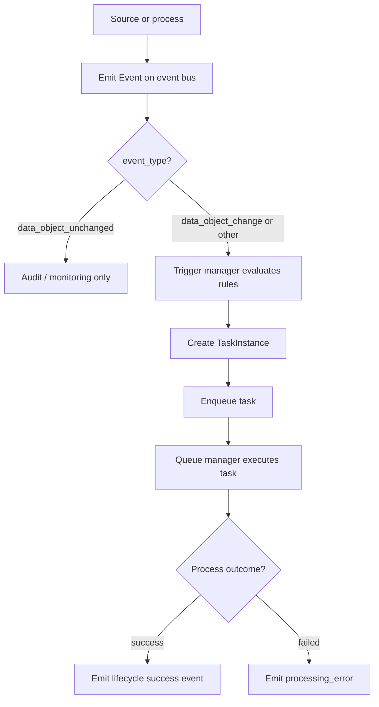

# Event-based orchestration

## Table of contents

<!-- markdown-toc:start -->
- [Purpose](#purpose)
- [Benefits](#benefits)
- [Summary](#summary)
- [Components](#components)
  - [Event](#event)
  - [Trigger](#trigger)
  - [Task](#task)
    - [TaskDefinition](#taskdefinition)
    - [TaskInstance](#taskinstance)
  - [Queue](#queue)
  - [Core event-driven flow](#core-event-driven-flow)
<!-- markdown-toc:end -->

## Purpose

Orchestration is the central engine that starts processes to read, transform, and write data. Many processes can run at the same time, and there can be many dependencies between processes, or between a process and external events. This design pattern lets you define these processes, dependencies, and events in a declarative way, making it easier to understand and maintain.

## Benefits

- Maintainability. Because we define orchestration in a declarative way, it is easier to maintain and understand compared to orchestration described in an imperative way (for example, encoded in pipelines or SQL code).
- Scalability. As the data platform grows, more processes and events run simultaneously, requiring more centralized control and visibility. By decoupling process administration from process execution, it becomes easier to scale and define how processes can be executed in parallel.
- Auditability. We need the ability to troubleshoot which events and processes caused data to be read, transformed, or written. This is important for explaining errors and for data-lineage analysis.

## Summary

Events trigger tasks, that are queued for execution. This way we can manage the execution of these tasks. 
E.g. by prioritizing important tasks over less important tasks, manage compute power and manage long running or failing tasks. 

## Components

### Event

The `Event` entity captures every relevant change or process signal that can trigger orchestration. It is the entry point of the pattern and stores the event type, related process lifecycle, identifying attributes of the related data object, and operational metrics.

**Process lifecycle**

Events can be classified into the following categories:
| Lifecycle | Meaning |
|-----------|---------|
| `start` | A process instance began. |
| `success` | A process instance finished successfully. |
| `failed` | A process instance failed. |
| `in_progress` | A process instance is still running. |

Unless an event name specifies otherwise, the **default interpretation is that the related process succeeded**. 

**Event glossary**

| Event | Meaning |
|-------|---------|
| `file_write_start` | A file write began; the outcome is not yet known. |
| `file_write` | A file finished writing to storage successfully. |
| `file_write_failure` | A file write failed or was rolled back. |
| `data_object_delete` | A data object was removed successfully. |
| `data_object_schema_change` | The schema of a source or data object changed successfully. |
| `data_object_change` | A polled or observed data object has a new change marker (for example a file name, observation day, or `lastModified` value). |
| `data_object_unchanged` | A poll or check completed successfully and the change marker is unchanged. |
| `processing_error` | A process failed and was rolled back or aborted. |
| `crash` | A process terminated unexpectedly without a controlled failure signal. |

**Change scope** (attribute on `data_object_change`)

| `change_scope` | Meaning |
|----------------|---------|
| `incremental_update` | New or appended data since the last marker (for example a new observation day). |
| `full_rewrite` | The data object was fully replaced in one run. |
| `historical_rewrite` | Past data was corrected or backfilled. |

Examples:
- A CSV file has finished uploading to a storage container.
- A Delta table was successfully updated with today's increment (`data_object_change`, `change_scope=incremental_update`).
- A schema was changed in a production database that delivers data to us.
- A [data object poller](../data-engineering/data-object-poller.md) detected a new source marker and published **data object change**.
- The same poller ran on schedule, found no marker change, and published **data object unchanged** so operators know polling is healthy.
- A long-running ingestion emits periodic updates with a progress percentage.
- A network error caused a database write to be rolled back.
- A process finished transforming raw customer data from system A into curated/integrated data.

### Trigger

A trigger defines routing logic that maps incoming events to executable task templates. Triggers can filter on event type, process lifecycle, and related data object attributes.

Examples:
- A trigger named `trigger_ingest_raw_data_from_blob_container` matches events where data was successfully written to a blob container and routes them to the task `ingest_raw_data_from_blob_container`.
- A trigger named `trigger_transform_curated_data_when_raw_data_arrived` fires when all required raw data has arrived for a curated data object.
- A rule named `alert_on_failed_ingest` matches failure events and routes them to a notification task.

### Task

#### TaskDefinition

A task definition describes the blueprint of a task that is triggered by an event.

#### TaskInstance

A task instance is a concrete instantiation of a task definition for a specific data object, triggered by an event. It links to a trigger and an event and is put into a queue so the queue manager can execute it.

### Queue

This is a list of task instances with additional execution attributes:
- Priority
- Status
- Start timestamp
- Finish timestamp
- Retry count
- Last error message

### Core event-driven flow

1. A source or process emits an `Event` onto the event bus (for example a poller publishes `data_object_change` or `data_object_unchanged`).
2. After an event is registered, a trigger manager evaluates triggers for that `event_type`. `data_object_unchanged` events are logged or monitored only; `data_object_change` events match rules that enqueue work (for example starting a [data extractor](../data-engineering/data-extractor.md) task).
3. For each matching trigger, the manager creates task instances and puts them in the queue.
4. A queue manager runs on a heartbeat, for example every 5 minutes, or earlier when the queue backlog exceeds a threshold.

The poller never executes extraction itself — it only detects and signals. Extraction runs as separate tasks triggered by `data_object_change` events.

## Project structure

<!-- markdown-project-structure:start -->
- [Data Engineering Design Patterns](../../readme.md)
  - Definitions
    - [Business intelligence](../../definitions/business-intelligence.md)
    - [Data engineering](../../definitions/data-engineering.md)
    - [Data](../../definitions/data.md)
  - Design patterns
    - Data engineering
      - [Data extractor](data-extractor.md)
      - [Data object container](data-object-container.md)
      - [Data object contract](data-object-contract.md)
      - [Data object poller](data-object-poller.md)
      - [Data object quality of service](data-object-quality-of-service.md)
      - [Data object quality](data-object-quality.md)
      - [Data object refresh contract](data-object-refresh-contract.md)
      - [Data object tree property inheritance](data-object-tree-property-inheritance.md)
      - [Data object tree](data-object-tree.md)
      - [Data object](data-object.md)
      - [Data solution layer](data-solution-layer.md)
      - [Data solution](data-solution.md)
      - [Event-based orchestration](event-based-orchestration.md)
      - [Historic bitemporal table](historic-bitemporal-table.md)
    - Generic
      - [Functional decomposition](../generic/functional-decomposition.md)
      - [Prefer simple decomposition](../generic/prefer-simple-decomposition.md)
      - [Separate what and how](../generic/separate-what-and-how.md)
      - [Simplicity](../generic/simplicity.md)
  - Implementation
    - Data Object Refresh Contract
      - [Data object refresh contract alternatives](../../implementation/data-object-refresh-contract/alternatives.md)
    - Event Based Orchestration
      - [Event-based orchestration architecture](../../implementation/event-based-orchestration/architecture.md)
      - [Azure event-based orchestration architecture](../../implementation/event-based-orchestration/azure-architecture.md)
      - [Tool choice for a data warehouse orchestration tool](../../implementation/event-based-orchestration/tool-choice.md)
- Related repositories
  - [Data Engineering 2026](https://github.com/basvdberg/data-engineering-2026) — Course and learning materials
  - [Data Solution 2026](https://github.com/basvdberg/data-solution-2026) — Data solution proof of concept
<!-- markdown-project-structure:end -->
