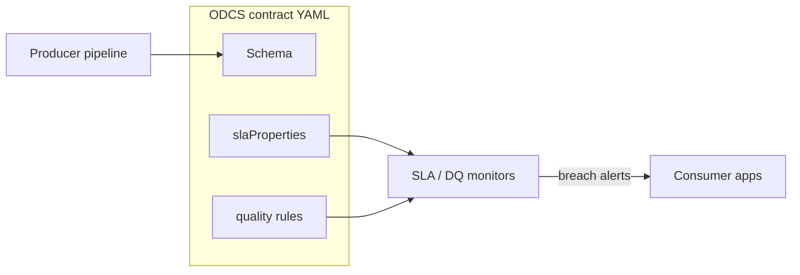
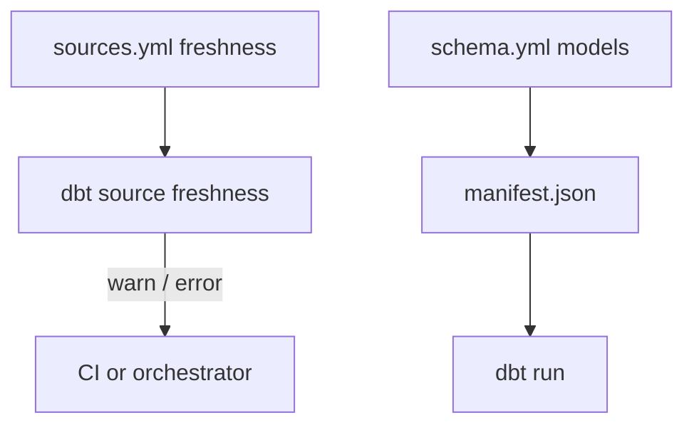
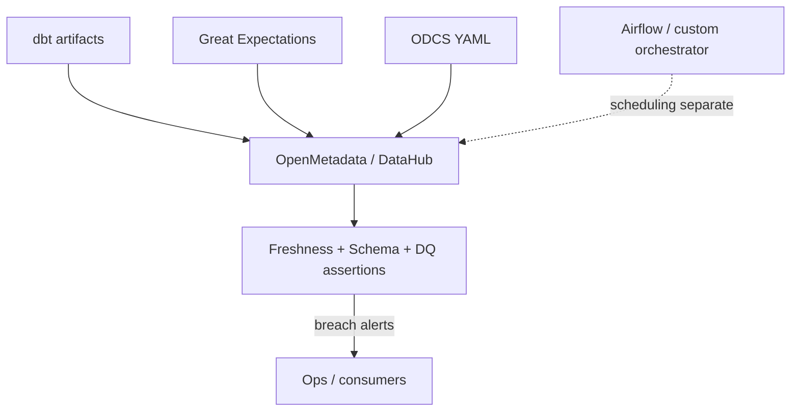

# Data object refresh contract alternatives

## Table of contents

<!-- markdown-toc:start -->
- [Purpose](#purpose)
- [Baseline for comparison](#baseline-for-comparison)
- [Alternative 1: Open Data Contract Standard (ODCS)](#alternative-1-open-data-contract-standard-odcs)
  - [Pros](#pros)
  - [Cons](#cons)
- [Alternative 2: dbt-native metadata (sources freshness + manifest lineage)](#alternative-2-dbt-native-metadata-sources-freshness-manifest-lineage)
  - [Pros](#pros)
  - [Cons](#cons)
- [Alternative 3: Catalog assertion contracts (DataHub / OpenMetadata)](#alternative-3-catalog-assertion-contracts-datahub-openmetadata)
  - [Pros](#pros)
  - [Cons](#cons)
- [Side-by-side summary](#side-by-side-summary)
- [Recommendation](#recommendation)
- [Orchestrator-native scheduling (related, not a full alternative)](#orchestrator-native-scheduling-related-not-a-full-alternative)
<!-- markdown-toc:end -->

## Purpose

This document compares three established industry approaches to data refresh and freshness metadata against the [data object refresh contract](../../design-patterns/data-engineering/data-object-refresh-contract.md) pattern and the [data-solution-2026](https://github.com/basvdberg/data-solution-2026) JSON metadata implementation. Use it when evaluating whether to adopt an external standard, integrate with an existing toolchain, or keep a custom orchestration-native catalog.

## Baseline for comparison

The [data object refresh contract](../../design-patterns/data-engineering/data-object-refresh-contract.md) pattern and [data-solution-metadata.schema.json](https://github.com/basvdberg/data-solution-2026/blob/main/schema/data-solution-metadata.schema.json) combine **scheduling triggers** and **consumer promises** on each `DataObject`:

| Concern | This pattern |
|---------|--------------|
| **When to refresh** | `TimeTrigger` (cron), `DependencyTrigger` (upstream publish/change), `triggerMode` (time, dependency, AND/OR) |
| **What slice refreshed** | `RefreshScope`: all / subset / partition |
| **What consumers may rely on** | `ConsumerPromise` (in pattern; not yet in JSON schema): `availableBy`, `maxStaleness`, `updateFrequency` |
| **Where metadata lives** | Git-versioned JSON artifacts per object (`data-object/**/*.json`) |
| **How it drives work** | Feeds [event-based orchestration](../../design-patterns/data-engineering/event-based-orchestration.md)—triggers emit refresh signals |

Example from the proof of concept:

```json
"refreshContract": {
  "triggerMode": "time",
  "timeTrigger": { "schedule": "@hourly" },
  "refreshScope": "all",
  "notes": "Every hour potentially the full table is refreshed."
}
```

This design is unusually complete for **orchestration-first** refresh metadata: it models interval alignment, arrival windows, and out-of-sync dependency edge cases—areas most alternatives handle poorly or not at all.

## Alternative 1: Open Data Contract Standard (ODCS)

**What it is:** A Linux Foundation–backed, tool-agnostic YAML specification for formal producer–consumer agreements. Widely cited in data-mesh literature ([ODCS SLA docs](https://bitol-io.github.io/open-data-contract-standard/v3.1.0/service-level-agreement/), [Towards Data Science overview](https://towardsdatascience.com/from-monolith-to-contract-driven-data-mesh/)).

**How refresh/freshness is expressed:** Under `slaProperties`, using a Data QoS vocabulary—primarily `latency`, `frequency`, and `timeOfAvailability`—optionally tied to a column `element` and a cron `schedule` for SLA *checks* (not pipeline triggers).

```yaml
slaProperties:
  - property: latency
    value: 4
    unit: d
    element: tab1.txn_ref_dt
    scheduler: cron
    schedule: "0 30 * * *"
  - property: timeOfAvailability
    value: "09:00-08:00"
    element: tab1.txn_ref_dt
    driver: regulatory
```

ODCS also bundles schema, data-quality rules (with their own schedules), ownership, and access in one contract file.



### Pros

- **Industry standard** with growing tool support (Data Contract CLI, Soda, Great Expectations integrations).
- **Producer–consumer framing** is explicit—good for data-mesh governance and cross-team negotiation.
- **Rich SLA vocabulary** (latency, retention, time-to-repair) beyond simple cron schedules.
- **Single artifact** for schema + quality + SLA + ownership—reduces metadata fragmentation.
- **Versioned, reviewable** YAML in git—similar governance model to a JSON catalog.

### Cons

- **Monitoring-oriented, not orchestration-oriented.** SLA schedules describe when to *check* freshness, not when to *run* extract/transform or how to combine time + upstream dependencies.
- **No first-class dependency triggers** between data objects (no equivalent to `DependencyTrigger`, `ArrivalWindow`, or partition-aligned scope).
- **No `triggerMode` semantics** (time AND dependency vs OR)—orchestration logic stays in Airflow/Dagster/dbt, not the contract.
- **Heavier spec** than needed if refresh scheduling is the main goal; schema/DQ dominate the document.
- **Less precise on interval alignment**—does not address the out-of-sync partition problem documented in the refresh contract pattern.

**Fit vs this pattern:** ODCS is the closest *governance* peer. Map `ConsumerPromise` → ODCS `slaProperties`; `TimeTrigger`/`DependencyTrigger` have no direct ODCS equivalent. Hybrid pattern: keep refresh triggers in your catalog, publish an ODCS SLA slice to consumers.

## Alternative 2: dbt-native metadata (sources freshness + manifest lineage)

**What it is:** Freshness and dependency metadata live **inside the transformation project**—`sources.yml` for upstream freshness, `schema.yml` for models, and auto-generated `manifest.json` / `run_results.json` artifacts ([dbt freshness reference](https://docs.getdbt.com/reference/resource-properties/freshness)).

**How refresh/freshness is expressed:**

```yaml
sources:
  - name: jaffle_shop
    config:
      freshness:
        warn_after: {count: 12, period: hour}
        error_after: {count: 24, period: hour}
      loaded_at_field: _etl_loaded_at
    tables:
      - name: orders
```

- **`dbt source freshness`** queries `loaded_at_field` and compares max timestamp to thresholds.
- **Lineage** comes from `ref()` / `source()` in SQL, materialized in `manifest.json`.
- **dbt Fusion / state-aware orchestration** (newer) can use warehouse metadata and `lag_tolerance` to skip rebuilds when upstream is unchanged—closer to dependency-driven refresh, but dbt-specific.



### Pros

- **Very high adoption** in analytics engineering; minimal new concepts if the team already uses dbt.
- **Freshness is executable**—`dbt source freshness` runs real queries, not just declared intent.
- **Lineage is derived** from code (`ref`/`source`), so it stays accurate as models change.
- **Tight CI integration**—freshness failures block merges or deployments.
- **Low ceremony** for simple cases (hourly/daily staleness on a timestamp column).

### Cons

- **Freshness is observability, not scheduling.** Thresholds detect staleness; they do not declare when extraction should start or how to wait for multiple upstream objects.
- **Scope is dbt-centric**—raw landing zones, non-dbt extractors, and API pollers are second-class unless wrapped as dbt sources.
- **No consumer promise model**—`warn_after`/`error_after` are operator thresholds, not downstream SLAs with `availableBy`.
- **Weak partition / interval semantics**—no `RefreshScope`, no guard against mixing D-1 and D-2 upstream partitions.
- **Metadata split** across YAML files and generated artifacts; harder to treat as a unified solution catalog spanning connections, mappings, and objects.
- **Dependency triggers** require orchestrator glue (Airflow Dataset, Dagster sensor, or dbt Fusion)—not declared in source freshness config.

**Fit vs this pattern:** dbt replaces the `ConsumerPromise` monitoring slice and part of lineage, but not the `RefreshContract` orchestration model. Common in warehouses; weak for multi-layer catalogs (source → staging → curated) where extract and transform are separate systems.

## Alternative 3: Catalog assertion contracts (DataHub / OpenMetadata)

**What it is:** A **central metadata platform** where each dataset carries verifiable **assertion contracts**—schema, freshness, and data-quality guarantees—often ingested from dbt, Great Expectations, or defined in the catalog UI ([DataHub DataContract entity](https://docs.datahub.com/docs/generated/metamodel/entities/datacontract), [OpenMetadata dbt workflow](https://docs.open-metadata.org/v1.12.x/connectors/database/dbt)).

**How refresh/freshness is expressed:**

- **Freshness assertions**: max latency since last update, update frequency, or custom SQL checks.
- **Schema / DQ assertions**: linked to the same contract entity.
- **Optional `rawContract`**: YAML blob (can embed ODCS).
- **Operational state**: pass/fail history, ownership, lineage graph, discovery UI.



### Pros

- **Unified discovery and governance**—one graph for lineage, owners, glossary, quality, and contracts.
- **Assertions are monitorable** with history, dashboards, and alerting—strong for `ConsumerPromise`-style SLA tracking.
- **Integrates existing tools** (dbt manifest, GE, Soda) instead of replacing them.
- **Cross-system view**—warehouse tables, pipelines, and APIs in one place.
- **AI/agent-friendly**—rich context graph (increasingly used for governance copilots).

### Cons

- **Platform overhead**—deploy, operate, and keep ingestion pipelines current.
- **Scheduling is external**—catalog knows *whether* data is fresh; it does not emit refresh signals or model `triggerMode` / `DependencyTrigger`.
- **Contract model varies by product**—DataHub vs OpenMetadata vs Atlan differ in freshness contract shape and APIs.
- **Risk of metadata drift**—if ingestion lags, the catalog lies; git-native JSON is always what was reviewed in PR.
- **Partition alignment and arrival windows** are not first-class; encode them in custom properties or external orchestration metadata.
- **Duplication** if you also maintain dbt YAML + ODCS + catalog definitions.

**Fit vs this pattern:** Best for **enterprise discoverability and SLA monitoring** after publish. Complements rather than replaces refresh-contract-driven orchestration. A `publish success` dependency signal could *feed* catalog freshness assertions.

## Side-by-side summary

| Dimension | Refresh contract | ODCS | dbt freshness | Catalog assertions |
|-----------|------------------|------|---------------|-------------------|
| **Primary purpose** | Drive + monitor refresh | Govern producer–consumer agreement | Detect stale sources | Discover + assert guarantees |
| **Time scheduling** | `TimeTrigger` (cron) | SLA check schedule only | Via external orchestrator | Not built-in |
| **Upstream dependencies** | First-class `DependencyTrigger` | Implicit via lineage tools | `ref`/`source` in manifest | Lineage graph only |
| **Partition / interval safety** | `RefreshScope` + alignment rules | Weak | Weak | Weak |
| **Consumer SLA** | `ConsumerPromise` | `slaProperties` | `warn_after` / `error_after` | Freshness assertions |
| **Metadata location** | Git JSON per object | Git YAML per contract | dbt project + artifacts | Platform database |
| **Executable checks** | Via poller/orchestrator | Via integrated DQ/SLA tools | `dbt source freshness` | Platform assertion runners |
| **Adoption / ecosystem** | Custom (PoC) | Growing standard | Very high in analytics | High in enterprise |

## Recommendation

The [data object refresh contract](../../design-patterns/data-engineering/data-object-refresh-contract.md) occupies a **distinct niche**: **orchestration-native refresh contracts** with explicit dependency and interval semantics. None of the three alternatives replace that cleanly.

Practical combinations seen in the industry:

1. **Your catalog for triggers** + **ODCS or catalog assertions for consumer-facing SLA** (avoid duplicating schema/DQ in JSON if ODCS already covers it).
2. **dbt for warehouse layer** freshness checks + **your catalog for extract/staging** objects dbt does not own.
3. **Catalog as read replica**—ingest JSON metadata and publish events into OpenMetadata/DataHub for discovery, without making the catalog authoritative for scheduling.

If you want a single alternative that covers the most overlap with the *consumer promise* slice, choose **ODCS**. For the widest existing adoption, choose **dbt freshness**. For enterprise metadata hub requirements, choose **catalog assertions**.

## Orchestrator-native scheduling (related, not a full alternative)

**Airflow Assets/Datasets** ([Airflow docs](https://airflow.apache.org/docs/apache-airflow/3.0.1/authoring-and-scheduling/assets.html)) and **Dagster automation policies** are valid approaches for *dependency-driven scheduling*, but they store metadata in DAG/asset code—not in a portable object catalog. They track **task success**, not data freshness or partition alignment, unless you add custom `extra` metadata on asset events. Use them as an execution layer under any of the above metadata models, not as a full replacement for a refresh contract.

## Project structure

<!-- markdown-project-structure:start -->
- [Data Engineering Design Patterns](../../readme.md)
  - Definitions
    - [Business intelligence](../../definitions/business-intelligence.md)
    - [Data engineering](../../definitions/data-engineering.md)
    - [Data](../../definitions/data.md)
  - Design patterns
    - Data engineering
      - [Data extractor](../../design-patterns/data-engineering/data-extractor.md)
      - [Data object container](../../design-patterns/data-engineering/data-object-container.md)
      - [Data object contract](../../design-patterns/data-engineering/data-object-contract.md)
      - [Data object poller](../../design-patterns/data-engineering/data-object-poller.md)
      - [Data object quality of service](../../design-patterns/data-engineering/data-object-quality-of-service.md)
      - [Data object quality](../../design-patterns/data-engineering/data-object-quality.md)
      - [Data object refresh contract](../../design-patterns/data-engineering/data-object-refresh-contract.md)
      - [Data object tree property inheritance](../../design-patterns/data-engineering/data-object-tree-property-inheritance.md)
      - [Data object tree](../../design-patterns/data-engineering/data-object-tree.md)
      - [Data object](../../design-patterns/data-engineering/data-object.md)
      - [Data solution layer](../../design-patterns/data-engineering/data-solution-layer.md)
      - [Data solution](../../design-patterns/data-engineering/data-solution.md)
      - [Event-based orchestration](../../design-patterns/data-engineering/event-based-orchestration.md)
      - [Historic bitemporal table](../../design-patterns/data-engineering/historic-bitemporal-table.md)
    - Generic
      - [Functional decomposition](../../design-patterns/generic/functional-decomposition.md)
      - [Prefer simple decomposition](../../design-patterns/generic/prefer-simple-decomposition.md)
      - [Separate what and how](../../design-patterns/generic/separate-what-and-how.md)
      - [Simplicity](../../design-patterns/generic/simplicity.md)
  - Implementation
    - Data Object Refresh Contract
      - [Data object refresh contract alternatives](alternatives.md)
    - Event Based Orchestration
      - [Event-based orchestration architecture](../event-based-orchestration/architecture.md)
      - [Azure event-based orchestration architecture](../event-based-orchestration/azure-architecture.md)
      - [Tool choice for a data warehouse orchestration tool](../event-based-orchestration/tool-choice.md)
- Related repositories
  - [Data Engineering 2026](https://github.com/basvdberg/data-engineering-2026) — Course and learning materials
  - [Data Solution 2026](https://github.com/basvdberg/data-solution-2026) — Data solution proof of concept
<!-- markdown-project-structure:end -->
