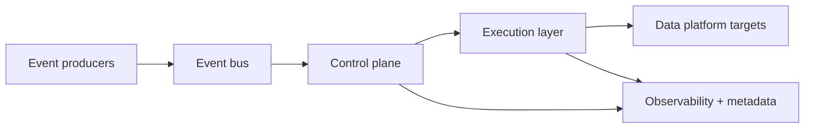

# Event-based orchestration architecture

## Table of contents

<!-- markdown-toc:start -->
- [Purpose](#purpose)
- [Architecture goals](#architecture-goals)
- [High-level architecture](#high-level-architecture)
- [Core components](#core-components)
  - [1) Event producers](#1-event-producers)
  - [2) Event bus](#2-event-bus)
  - [3) Event registry and schema validation](#3-event-registry-and-schema-validation)
  - [4) Controller rules engine](#4-controller-rules-engine)
  - [5) Execution queue](#5-execution-queue)
  - [6) Orchestrator workers](#6-orchestrator-workers)
  - [7) Metadata and observability](#7-metadata-and-observability)
- [Event contract (minimum)](#event-contract-minimum)
- [Reference processing flow](#reference-processing-flow)
- [Reliability patterns](#reliability-patterns)
- [Security and governance](#security-and-governance)
- [Recommended implementation stack](#recommended-implementation-stack)
- [Phased rollout plan](#phased-rollout-plan)
  - [Phase 1 - Foundation](#phase-1-foundation)
  - [Phase 2 - Orchestration control loop](#phase-2-orchestration-control-loop)
  - [Phase 3 - Hardening](#phase-3-hardening)
- [Definition of done](#definition-of-done)
<!-- markdown-toc:end -->

## Purpose

Define a production-ready architecture for event-based orchestration in data engineering, where events trigger controlled, reliable, and observable execution of ingestion and transformation workflows.

## Architecture goals

- Decouple producers and consumers through asynchronous events
- Support idempotent and replayable processing
- Guarantee operational visibility (traceability, metrics, alerts)
- Enforce policy-driven routing and execution decisions
- Scale horizontally for bursty workloads

## High-level architecture

## Core components

### 1) Event producers

- Source-specific adapters publish domain events (for example: file landed, table changed, API snapshot ready)
- Producers attach metadata: source ID, object path, event time, correlation ID, payload hash

### 2) Event bus

- Durable pub/sub backbone (`Kafka`, `Event Hubs`, `Pub/Sub`, `SNS/SQS`)
- Topic separation by domain and criticality
- Retention configured for replay and recovery

### 3) Event registry and schema validation

- Contract-first event schemas with versioning
- Backward-compatible schema evolution rules
- Reject or quarantine malformed events

### 4) Controller rules engine

- Evaluates incoming events against declarative routing rules
- Maps events to executable task templates
- Applies priority, throttling, and policy constraints

### 5) Execution queue

- Stores runnable tasks with status and retry metadata
- Supports scheduling, prioritization, and dead-letter flows
- Enables backpressure between control plane and workers

### 6) Orchestrator workers

- Pull tasks from queue and execute workflow steps
- Integrate with compute backends (`Airflow`, `Databricks`, `Spark`, SQL engines)
- Write run state transitions (`queued`, `running`, `succeeded`, `failed`, `retrying`)

### 7) Metadata and observability

- Metadata store tracks events, routing decisions, task runs, and lineage references
- Central logging, metrics, tracing, and alerting
- SLA and freshness monitoring by data product

## Event contract (minimum)

Every event should contain:

- `event_id` (globally unique)
- `event_type` (business/action semantics)
- `event_time` (UTC)
- `source_system` and `source_object`
- `correlation_id` (for end-to-end traceability)
- `idempotency_key` (dedupe key)
- `schema_version`
- `payload` (business data or reference)

## Reference processing flow

1. Producer emits event to bus.
2. Validator checks schema and routes invalid events to quarantine.
3. Rules engine selects a task template and execution policy.
4. Queue stores the task with priority and retry policy.
5. Worker executes task and emits lifecycle events (`start`, `progress`, `end`).
6. Metadata store and observability systems are updated.
7. On failure, retry with exponential backoff; after max retries, dead-letter and alert.

## Reliability patterns

- Idempotent writes for all target updates
- Exactly-once business outcome through dedupe + idempotency keys
- Replay support from event retention and checkpointing
- Dead-letter queues for poison events
- Circuit breakers and rate limits for unstable dependencies

## Security and governance

- Managed identities/service principals for system-to-system access
- Secrets in secure vault, never in code or event payloads
- RBAC for topics, queues, and orchestration actions
- End-to-end audit trail for compliance and incident analysis
- Data classification tags in metadata for policy enforcement

## Recommended implementation stack

- **Control plane:** `Airflow` or comparable orchestrator
- **Event bus:** `Kafka` / cloud-native equivalent
- **Rules engine:** declarative rules in SQL/YAML-backed config tables
- **Queue:** `SQS`, `Service Bus`, `RabbitMQ`, or internal queue DB table
- **Metadata store:** `PostgreSQL` (or managed relational equivalent)
- **Observability:** `OpenTelemetry` + `Prometheus/Grafana` + centralized logs

## Phased rollout plan

### Phase 1 - Foundation

- Define event taxonomy and schemas
- Build producer SDK/template
- Implement validation + quarantine path

### Phase 2 - Orchestration control loop

- Implement rules engine and task queue
- Deploy worker runtime and run-state model
- Add retries, dead-letter handling, and alerting

### Phase 3 - Hardening

- Add lineage integration and SLA dashboards
- Add replay tooling and operational runbooks
- Conduct failure injection and load testing

## Definition of done

- Event contracts are versioned and enforced
- End-to-end flow is observable with correlation IDs
- Retry and dead-letter behavior is tested
- Replay procedure is documented and validated
- Security controls (RBAC, secrets, audit) are enabled in production

## Project structure

<!-- markdown-project-structure:start -->
- [Data Engineering Design Patterns](../../readme.md)
  - Definitions
    - [Business intelligence](../../definitions/business-intelligence.md)
    - [Data engineering](../../definitions/data-engineering.md)
  - Design patterns
    - [Data extractor](../../design-patterns/data-extractor.md)
    - [Data object poller](../../design-patterns/data-object-poller.md)
    - [Data solution](../../design-patterns/data-solution.md)
    - [Event-based orchestration](../../design-patterns/event-based-orchestration.md)
    - [Historic bitemporal table](../../design-patterns/historic-bitemporal-table.md)
    - [Data object property tree](../../design-patterns/object-property-tree.md)
    - [Separate what and how](../../design-patterns/separate-what-and-how.md)
  - Implementation
    - Event Based Orchestration
      - [Event-based orchestration architecture](architecture.md)
      - [Azure event-based orchestration architecture](azure-architecture.md)
      - [Tool choice for a data warehouse orchestration tool](tool-choice.md)
- Related repositories
  - [Data Engineering 2026](https://github.com/basvdberg/data-engineering-2026)
  - [Data Solution 2026](https://github.com/basvdberg/data-solution-2026)
<!-- markdown-project-structure:end -->
