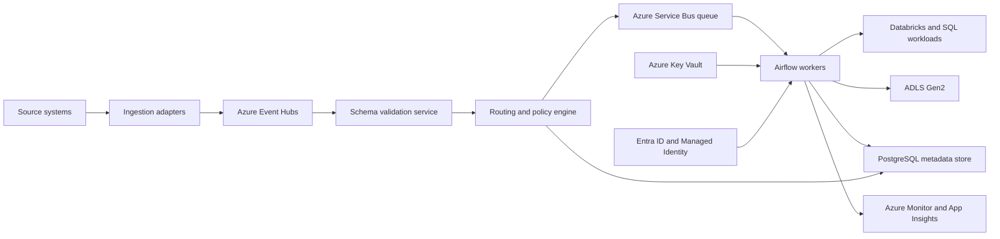

# Azure event-based orchestration architecture

## Table of contents

<!-- markdown-toc:start -->
- [Purpose](#purpose)
- [Recommended Azure stack](#recommended-azure-stack)
- [High-level architecture](#high-level-architecture)
- [Event and command model](#event-and-command-model)
  - [Event envelope (from producers)](#event-envelope-from-producers)
  - [Command envelope (to execution queue)](#command-envelope-to-execution-queue)
- [Reference flow](#reference-flow)
- [Airflow on Azure: most practical setup](#airflow-on-azure-most-practical-setup)
- [Network and security baseline](#network-and-security-baseline)
- [Reliability and operations](#reliability-and-operations)
- [Deployment model](#deployment-model)
  - [Environments](#environments)
  - [IaC and release](#iac-and-release)
- [Minimal implementation backlog](#minimal-implementation-backlog)
- [Decision notes](#decision-notes)
<!-- markdown-toc:end -->

## Purpose

Define a concrete Azure reference architecture for event-based orchestration of data ingestion and transformation workloads.

## Recommended Azure stack

- **Event ingestion and streaming:** `Azure Event Hubs`
- **Command/task queueing:** `Azure Service Bus` (queues + dead-letter queue)
- **Workflow orchestration:** `Apache Airflow` (managed, for example via Astronomer or self-hosted on `AKS`)
- **Compute backends:** `Azure Databricks`, `Azure Functions`, `Azure SQL` / `Synapse` / `Fabric`
- **Metadata and run state:** `Azure Database for PostgreSQL`
- **Secrets and keys:** `Azure Key Vault`
- **Identity and access:** `Microsoft Entra ID` + Managed Identity
- **Storage and bronze landing:** `ADLS Gen2`
- **Observability:** `Azure Monitor`, `Log Analytics`, `Application Insights`, `OpenTelemetry`

## High-level architecture

## Event and command model

### Event envelope (from producers)

- `event_id`
- `event_type`
- `event_time_utc`
- `source_system`
- `source_object`
- `correlation_id`
- `idempotency_key`
- `schema_version`
- `payload_uri` (preferred for large payloads) or `payload`

### Command envelope (to execution queue)

- `command_id`
- `task_template_id`
- `priority`
- `retry_policy`
- `timeout_seconds`
- `correlation_id`
- `idempotency_key`

## Reference flow

1. Producer publishes event to `Event Hubs`.
2. Validation service verifies schema/version and rejects invalid events.
3. Routing engine maps event to task template and execution policy.
4. Command is placed on `Service Bus` queue with priority metadata.
5. Airflow worker picks command and executes target tasks (Databricks jobs, SQL steps, API calls).
6. Worker emits lifecycle events and writes run state to PostgreSQL.
7. Logs, traces, and metrics flow to Azure Monitor and Application Insights.
8. Failures retry with backoff; after max attempts, message moves to DLQ and an alert is raised.

## Airflow on Azure: most practical setup

- Use managed Airflow where possible; otherwise deploy to `AKS`.
- Prefer `KubernetesExecutor` for elastic scaling.
- Use remote logs to `ADLS Gen2` (or Blob Storage).
- Store Airflow metadata DB in managed PostgreSQL.
- Keep DAGs in Git and deploy through CI/CD.
- Use Airflow only for orchestration; execute heavy compute in Databricks/Spark/warehouse engines.

## Network and security baseline

- Private endpoints for `Event Hubs`, `Service Bus`, `Key Vault`, `Storage`, and `PostgreSQL`.
- `AKS` in private VNet with restricted egress.
- Managed identity for workload authentication; no static credentials in DAGs.
- Secrets (tokens, connection strings, certificates) only in Key Vault.
- RBAC separation for platform admins, data engineers, and operators.
- Encryption at rest and in transit enabled by default.

## Reliability and operations

- Idempotent target writes keyed by `idempotency_key`.
- DLQ triage process with replay tooling.
- Replay from Event Hubs retention or persisted event archive in ADLS.
- SLO dashboards: queue lag, success rate, p95 duration, freshness, DLQ volume.
- On-call alerts for queue backlog, repeated retries, and SLA breaches.

## Deployment model

### Environments

- `dev`, `test`, `prod` in separate subscriptions or strongly isolated resource groups.
- Environment-specific Key Vault and Service Bus namespaces.

### IaC and release

- Provision with `Terraform` or `Bicep`.
- CI: lint, unit tests, DAG validation.
- CD: promote DAGs/config with approvals and rollback support.

## Minimal implementation backlog

1. Define canonical event schema and version policy.
2. Build validation and routing services.
3. Create Service Bus queue contract and DLQ runbook.
4. Deploy Airflow with KubernetesExecutor and managed PostgreSQL.
5. Integrate Databricks job execution pattern.
6. Add end-to-end tracing with correlation IDs.
7. Implement replay utility and operational dashboards.

## Decision notes

- Choose `Event Hubs` when throughput and stream semantics are primary.
- Choose `Service Bus` for command-style orchestration with retries, ordering controls, and DLQ.
- Use both together when you need streaming ingestion plus reliable task dispatch.

## Project structure

<!-- markdown-project-structure:start -->
- [Data Engineering Design Patterns](../../readme.md)
  - Definitions
    - [Business intelligence](../../definitions/business-intelligence.md)
    - [Data engineering](../../definitions/data-engineering.md)
  - Design patterns
    - [Data extractor](../../design-patterns/data-extractor.md)
    - [Data object container](../../design-patterns/data-object-container.md)
    - [Data object poller](../../design-patterns/data-object-poller.md)
    - [Data object](../../design-patterns/data-object.md)
    - [Data solution layer](../../design-patterns/data-solution-layer.md)
    - [Data solution](../../design-patterns/data-solution.md)
    - [Event-based orchestration](../../design-patterns/event-based-orchestration.md)
    - [Historic bitemporal table](../../design-patterns/historic-bitemporal-table.md)
    - [Data object property tree](../../design-patterns/object-property-tree.md)
    - [Separate what and how](../../design-patterns/separate-what-and-how.md)
  - Implementation
    - Event Based Orchestration
      - [Event-based orchestration architecture](architecture.md)
      - [Azure event-based orchestration architecture](azure-architecture.md)
      - [Tool choice for a data warehouse orchestration tool](tool-choice.md)
- Related repositories
  - [Data Engineering 2026](https://github.com/basvdberg/data-engineering-2026)
  - [Data Solution 2026](https://github.com/basvdberg/data-solution-2026)
<!-- markdown-project-structure:end -->
