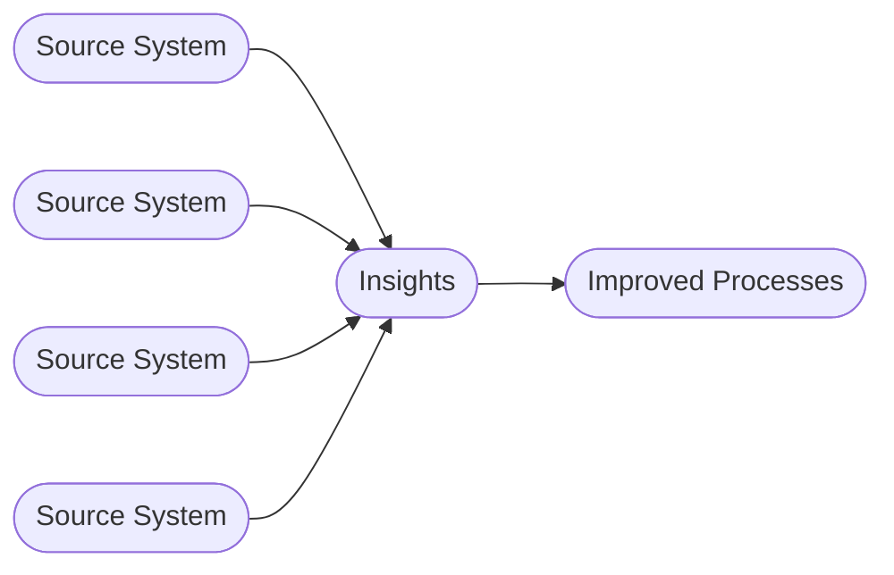
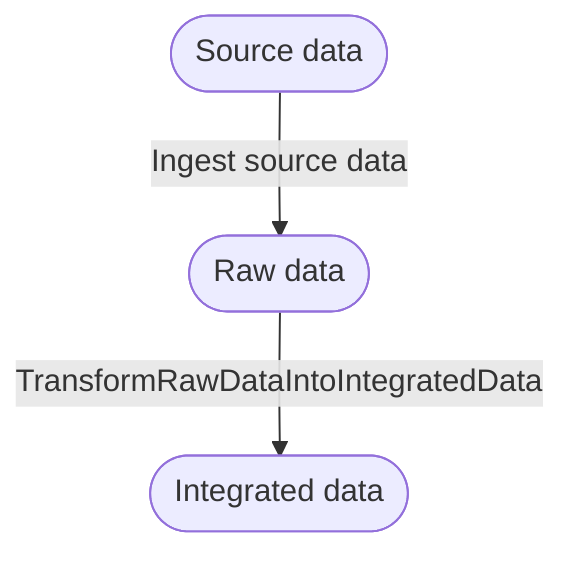

Use AI in the Data Engineering process

# Goal of this document

Analyze the opportunities that AI introduces in the field of data engineering, with a specific focus on the generation of ETL code. We will not lose time covering the entire domain; instead, we focus on the core concepts.

# Definitions

## Business intelligence

Business intelligence (BI) is the process of collecting, analyzing, and presenting business data to help organizations make informed, data-driven decisions. The definition of business intelligence overlaps with data engineering, but a key distinction is that BI includes presenting data to end users, while data engineering focuses on data processing and integration rather than presentation.

## Functional decomposition of the data engineering process

### Ingest source data

#### Definition
  - Use the interface provided by each source, including its query language, output format and data structure.
  - Follow the delivery contract, which specifies when data can be extracted and how often extraction is allowed.

#### Rationale
- **Connecting correctly to each source:** Use the right protocol, query language, schema, and format so data is extracted accurately and consistently.
- **Protecting source systems:** Control extraction load, schedule outside peak hours, and avoid conflicts with backups or maintenance.
- **Respecting data contracts:** Define what data can be extracted, when it can be delivered, and how often it is refreshed.
- **Security/privacy:** Ensure a data owner explicitly grants permission to use its data for specific applications and approved purposes only.
- **Traceability:** Document data origin, extraction logic, and operating rules to support auditing and lineage in further stages. 

#### Examples

| Source type | Example format |
| --- | --- |
| SQL Server database | Accessed over TCP/IP and queried with SQL to retrieve required data (interface). Access may be limited to specific tables and allowed only outside working hours, while avoiding overlap with backup and maintenance windows (contract). |
| Legacy mainframe system | Delivers a CSV file in a shared folder at a fixed time (for example around 23:00). The file contains only approved data fields and becomes available immediately after generation. |
| Operational Data Store (Delta table) | Provides a Delta table that is refreshed by the Operational Data Store on a defined schedule. Data is read using the Delta format. When a new snapshot is made available, all downstream subscribers are notified via an event. |

### Transform raw data into integrated data

#### Definition
  - Standardize and clean raw source data to create consistent, reusable datasets.
  - Apply business rules, joins, mappings, and validations to integrate data across source systems.
  - Publish the transformed output in a structured layer that downstream consumers can use.

#### Rationale
- **Data consistency:** Ensure common definitions, formats, and keys are used across all datasets.
- **Data quality:** Detect and correct errors, duplicates, and missing values before data is consumed.
- **Business context:** Convert technical source fields into business-ready attributes and metrics.
- **Integration across domains:** Combine records from multiple systems into a unified view.
- **Reusability:** Create curated datasets that can be used by analytics, reporting, and AI use cases.
- **Traceability:** Preserve lineage between raw inputs, transformation logic, and integrated outputs.

#### Examples

| Transformation type | Example format |
| --- | --- |
| Standardization | Convert date formats, country codes, and column names to enterprise standards. |
| Business rule mapping | Map source status codes to a shared business status model used across applications. |
| Multi-source integration | Join CRM customer records with billing and support data to produce a unified customer table. |

## Implementation definition

### Ingest source data

Implementation follows these concepts:
- Contract-first ingestion between data owner and consumer.
- Controlled connectivity and extraction within agreed delivery constraints.
- Idempotent orchestration with retries, error handling, and operational traceability.
- Event-driven control loop (events, rules, templates, queueing, execution).

Detailed schema and table specifications for these concepts are maintained in the `data model` folder.

# Design patterns

## Historic bitemporal table using recording time and valid time

When inserting data into a table, we record the timestamp that we make this change. This is the recording timestamp. We also record the time interval in which the record is valid. If this record, which is identified by a primary key, is changed, we don't change this record but insert a new record having a new record timestamp and potentially, but not necessarily, a new valid interval. 

Constraint: 
- A record identified by a primary key has no overlapping valid intervals. This means that when you record a change at timestamp `t`, the current valid record should be end-dated at `t`, and a new record should start at `t`.

When a new record is inserted, it has, by default, a valid interval that starts at the beginning of time and ends at the end of time.

Beginning of time (BOT) and end of time (EOT) are constants set to easy-to-read, very low and very high timestamp values (e.g. 1900-01-01 and 2099-01-01).

Reading from bitemporal table
1. Valid now view (default). This filters all records where the current timestamp is part of the valid interval.
2. Point in time view. This filters all records where a given timestamp is part of the valid interval.

#### Example

At `2026-01-01 09:00`, we insert:

| id | value | valid_from | valid_to | recorded_at |
| --- | --- | --- | --- | --- |
| 1 | A | 1900-01-01 | 2099-01-01 | 2026-01-01 09:00 |

#### Change handling

At `2026-02-01 10:00`, value changes from `A` to `B`.
We handle this by:
1. Closing the old interval at `2026-02-01 10:00`.
2. Inserting a new row starting at `2026-02-01 10:00`.

| id | value | valid_from | valid_to | recorded_at |
| --- | --- | --- | --- | --- |
| 1 | A | 1900-01-01 | 2026-02-01 10:00 | 2026-01-01 09:00 |
| 1 | B | 2026-02-01 10:00 | 2099-01-01 | 2026-02-01 10:00 |

## Object tree

Object table definitions and column-level details are maintained in the `data model` folder.

## Object tree properties

Object-property table definitions and column-level details are maintained in the `data model` folder.

## Data Engineering Specification Language (DESL)

In this chapter, we describe what is needed to implement the definitions from the previous chapter. The approach is to define what must be done using a declarative functional language and generate the required code from that definition.

## Schema definition language

### Functional Declarative Language for Data Engineering

### Design goals

- Declarative: describe *what* must happen, not *how* to execute it.
- Unambiguous for AI/code generators.
- From this language, an agent should be able to generate code for any orchestration tool (e.g. ADF, Airflow, others) via adapters. The language is orchestration-platform agnostic.
- Focused on source ingestion.
- Extensible to future patterns such as event-based processing and incremental loads.
### Proposal 1

Define DESL as a versioned YAML or JSON schema that describes:
- data objects (source, raw, integrated),
- contracts (delivery windows, allowed frequency, SLA),
- ingestion tasks (interface, retries, idempotency),
- event triggers and controller rules,
- validation and quality checks.

Each definition should compile into an intermediate execution plan. Adapters can then translate that plan into orchestration code for a target platform (for example Airflow DAGs or ADF pipelines). This keeps business intent stable while allowing implementation details to vary per platform.
